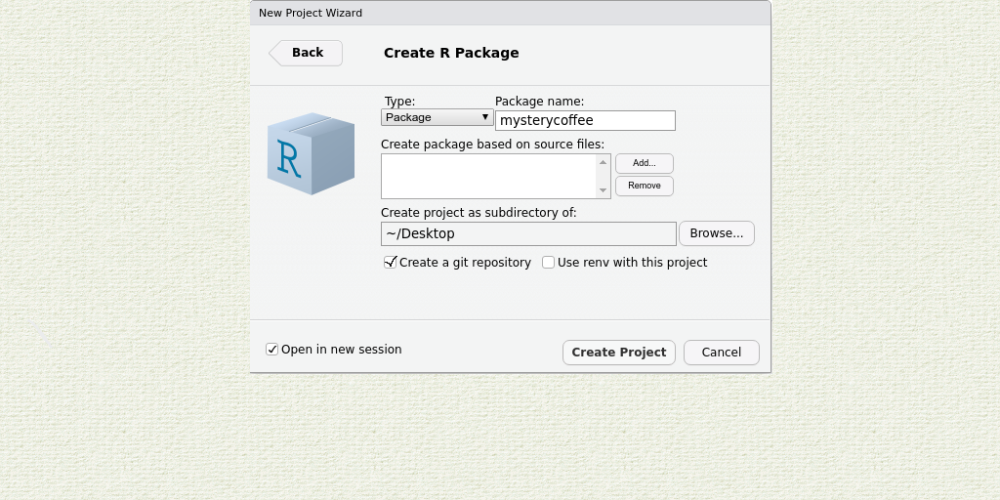
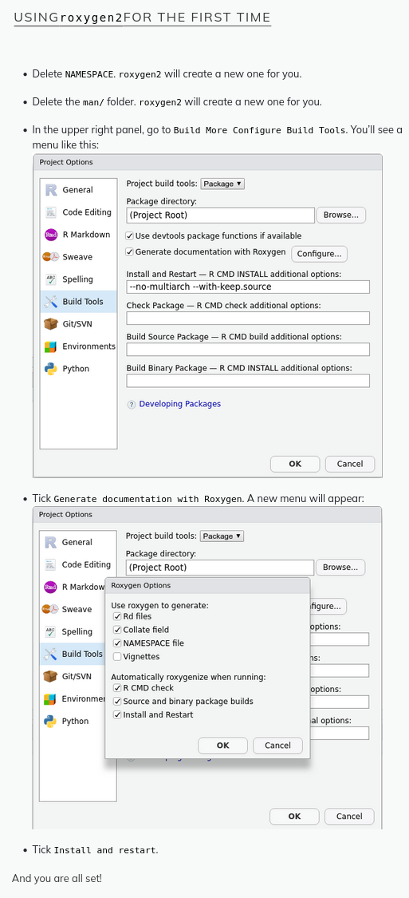
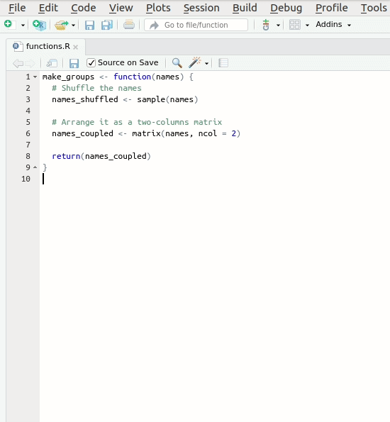

# R package tutorial

This tutorial will guide you through the process of creating an R package. We will use Rstudio and GitHub to create a package that contains a function to make groups of people. The tutorial is based on the [The Carpentries](https://carpentries-incubator.github.io/lesson-R-packaging/index.html) and [Happy Git and GitHub for the useR](https://happygitwithr.com/) by Jennifer Bryan.


## Getting started
### 0. [Install R and Rstudio](https://carpentries-incubator.github.io/lesson-R-packaging/index.html)

### 1. Open Rstudio

### 2. Install these packages:

```install.packages(c("devtools", "usethis", "rmarkdown", "roxygen2"))```

### 3. Create your R package (from [The Carpentries](https://carpentries-incubator.github.io/lesson-R-packaging/getting_started.html))
The menus in RStudio will help us in creating the most minimal of packages. Let’s open RStudio and look at the upper left corner. We will press File > New project > New directory, and see a menu like this:


As you can guess, we will now press R package. The new menu asks us to fill in some information. For the moment, bear with me and fill in the following:



Notice that:

-    We gave the package a name: mysterycoffee.
-    I created my package on my ~/Desktop folder, but you can use another location if you prefer.
-    We ticked the Create git repository. If you are not familiar with git, leave it unticked.
-    We left Use renv with this project unticked.
-    We ticked Open in new session.

Now we are ready to press Create Project.

### 4. Create a new GitHub repository (from [Happy Git and GitHub for the useR](https://happygitwithr.com/) by Jennifer Bryan)

First, you need to create a new repo on GitHub.

Go to https://github.com and make sure you are logged in.

Near “Repositories”, click the big green “New” button. Or, if you are on your own profile page, click on “Repositories”, then click the big green “New” button.

How to fill this in:

-   Repository template: No template.
-   Repository name: Ideally this will be the name of your local project’s directory (and RStudio Project). Why confuse yourself? But it must be a valid GitHub repo name, which means only letters, digits, -, ., or _ are allowed. For future projects, think about this in advance, i.e. make sure each project’s local name is also a valid GitHub repo name.
-   Description: “Analysis of the stuff” or any short description of the project. Write this for humans.
-   Public.
-   **DO NOT initialize this repository with anything.**

Click the big green button that says “Create repository”.

Now click the big green button that says “<> Code”.

Copy a clone URL to your clipboard. If you’re taking our default advice, copy the HTTPS URL. But if you’re opting for SSH, then make sure to copy the SSH URL.


Connect local repo to GitHub repo with RStudio

Click on the “two purple boxes and a white square” in the Git pane. Click “Add remote”. Paste the GitHub repo’s URL here and pick a remote name, almost certainly origin. Now “Add”.

We should be back in the “New Branch” dialog (if not, click on the “two purple boxes and a white square” in the Git pane again). I assume you’re on the main branch and want it to track main on GitHub (or whatever default branch you are using). Enter main as the branch name and make sure “Sync branch with remote” is checked. Click “Create” (yes, even though the branch already exists). In the next dialog, choose “overwrite”.

### 5. Push your package to GitHub
In the Git pane (top-right), check the box next to each file you want to commit. Then click the “Commit” button. Write a commit message and click “Commit”.

Now click the “Push” button. This will push your changes to GitHub.

### 6. Install your package from GitHub
```devtools::install_github("username/repo")```


## Next steps

### 1. Add a function to your package
```usethis::use_r("makegroups.R")```


### 2. Add function to makegroups.R
```R
make_groups <- function(names) {
  # Shuffle the names
  names_shuffled <- sample(names)

  # Arrange it as a two-columns matrix
  names_coupled <- matrix(names_shuffled, ncol = 2)

  return(names_coupled)
}
```

### 3. Document the function with Roxygen2

Unfortunately, using Roxygen2 requires some manual configuration. Please follow these steps:




Now, let’s document the function. When you have the R script where the function is open, use RStudio to add a Roxygen skeleton to the function:



Let’s take a look at the skeleton and fill it. It contains:

-    A Title section, where you can write what your function does. You can use add more comment lines below for a long description.
-    The return field refers to the function’s output.
-    The params field(s) refer to each of the function’s input(s).
-    The export field means that this function should be exported to the NAMESPACE. We’ll discuss it further later.
-    The examples field is used, as you can guess, for adding examples to the documentation. We’ll not use it now, so we can delete it. If you are interested in this or other optional parameters, please refer to roxygen2 documentation.

```R
#' Make groups of 2 persons
#'
#' Randomly arranges a vector of names into a matrix with 2 columns and
#' whatever number of columns is required
#'
#' @param names The vector of names
#'
#' @return The re-arranged matrix of names
#' @export
#'
```

Now save the file and run roxygen:


or use the command ```devtools::document()```

Now install your package again by clicking on the “Install and Restart” button in the Build pane.

Or use the command ```devtools::install()```

Now you can read your documentation:

```?make_groups```

### 4. Add a test
```usethis::use_test("makegroups")```

Check the generated file in the tests/testthat folder.
For now we will not add any 'real' tests, look at the [carpentries tutorial](https://carpentries-incubator.github.io/lesson-R-packaging/testing.html) for more information.

Now run the tests:

```
devtools::test()
```
This time, it only runs the default dummy test that is not actually testing something useful. Using this command, you can run all the tests in your package if you add more useful tests in the future.

### 5. Now we will finalize this tutorial. Please commit and push your changes to GitHub.
Now start close and restart RStudio. Also close the 'R project' you are working in. Then, install your package from GitHub and test your function.

```devtools::install_github("username/repo")
library(mypackage)
?make_groups
names <- c("Luke", "Vader", "Leia", "Chewbacca", "Solo", "R2D2")
grouped_names <- make_groups(names)
print(grouped_names)
```


## Resources

[http://r-pkgs.had.co.nz/](http://r-pkgs.had.co.nz/)

[https://carpentries-incubator.github.io/lesson-R-packaging/getting_started.html](https://carpentries-incubator.github.io/lesson-R-packaging/getting_started.html)

[https://happygitwithr.com/existing-github-last#create-and-connect-a-github-repo-without-usethis](https://happygitwithr.com/existing-github-last#create-and-connect-a-github-repo-without-usethis)


